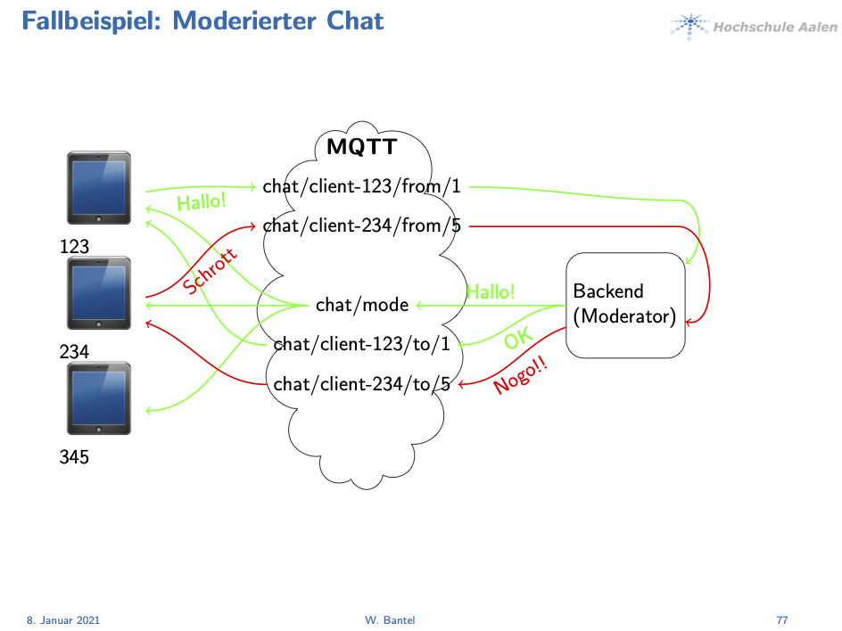

# mqtt-fetch.js
mqtt-fetch.js is a lightweight library for a fully transparent request-response-pattern for 
"fetch"ing data from a backend in a MQTT-based web-system.



It supports fetching data in background. i.e. you can code
```javascript
var a = await(m.send({nr: 123}));
```
and the JavaScript-Engine will be working while waiting.

Multiple transports can be done parallel at the same time, they can overlap too. The responses
don't not have to come in in the same order the request is done.


## Prerequisites
mqtt-fetch.js uses eclipse-paho (JavaScript)

## Correlation data
The library uses a counter

## Writing a backend
Each backend must subscribe
```
<prefix>/+/from/+
```
The first wildcard is for the client-id, the second for the counter.
Every received message has to be answered in
```
<prefix>/<client-id>/to/<counter>
```

## API

```javascript
constructor (prefix)
```
Parameters:
- prefix: an application-specific prefix. I.e. "chat" or "chat/client"

```javascript
init(host, port, uri, connect_prm)
```
Parameters:
- host: ip-address oder name of the server
- port: ip-port
- uri: For HTTP-protocol (can be omitted or be empty string)
- connect_prm: for username, password, SSL, see paho-lib. (Can be omitted or be empty object)

```javascript
send(v)
```
Parameters:
- v: Data (value) to send. Can be a String or an object. In case of object the backend must
        response a JSON-object

```javascript
set_callback(index, f, is_object)
```
Parameters:
- index:
    - if index is negative int then f is the callback for asynchronous messages for the client only
    - otherwise index is a topici for multiple clients (i.e. chat-messages) and f the callback therefore
- f: The callback-function
- is_object: if set to true a message-conversion to an object is made before callback


```javascript
async delete_callback(index)
```
Parameters:
- index: the (negative) int or a topic whose callback is no moreneeded
    
MQTT-topics are subscripted and unsubscripted automatically.

## Example
(from mqtt-chat.js)
```javascript
var m;
window.onload = async function() {
	m = new mqtt_fetch("chat/client");
	await m.init("localhost",1884);
//	await m.init("www.my-ssl-server.com",8083,"",{useSSL: true, userName: "...", password: "..."});
	m.mqtt_error = function(e) {console.log("Error " + e);};
	var c = await m.send({action: "get_chats"});
	for (var i = 0; i < c.chats.length; i++) {
		var n = document.createElement("option");
		n.text = n.value = c.chats[i];
		document.getElementById("chat").appendChild(n);
	}
	document.getElementById("send").addEventListener("click", send);
	document.getElementById("chat").addEventListener("change", chat_select);
}
```
## Example for a backend (Python)
(Only a "mirror"-backend)
```python
import paho.mqtt.client as mqtt
import paho.mqtt.client as mqtt

def on_connect(client, userdata, flags, rc):
    print("Connected with result code " + str(rc))
    client.subscribe("$share/squareserver/client/+/from/+")

def on_message(client, userdata, msg):
	print(msg.topic + " '" + str(msg.payload) + "'")
	response = str(msg.payload)
	client.publish(msg.topic.replace("/from/","/to/"), response)

client = mqtt.Client()
client.on_connect = on_connect
client.on_message = on_message
client.connect("localhost", 1883, 60)
client.loop_forever()

```
## Best practices
- Use shared subscriptions for the backend
- In that case start the backend multiple times, i.e. using supervisord (see examples)

## License
This project is licensed under the terms of the MIT license.
